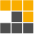
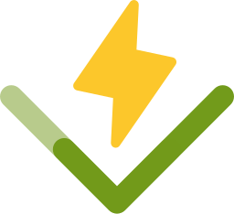
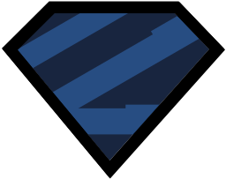
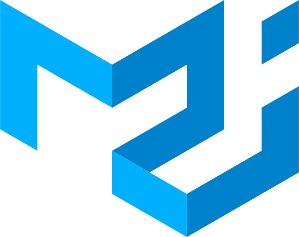

<h1 align="center">Hi, folks, how are you all doin' out there?</h1>
  

    
  

## I'm Emil. That's ⇗ my handsfree coding routine, and here ↴ is some stuff

---
## 🛠️ Toolbox

 &nbsp &nbsp

 &nbsp &nbsp

 &nbsp &nbsp

 &nbsp &nbsp

 &nbsp &nbsp

 &nbsp &nbsp

 &nbsp &nbsp

 &nbsp &nbsp

 &nbsp &nbsp

 &nbsp

 &nbsp

 &nbsp &nbsp

 &nbsp &nbsp

 &nbsp

 &nbsp

 &nbsp &nbsp

 &nbsp &nbsp

 &nbsp &nbsp

 &nbsp &nbsp

 &nbsp &nbsp

 &nbsp &nbsp

  

    Bonus fact: a
    
    user

  ---

  

    
💩
    
    
      
    
    
        
       &nbsp &nbsp
  

  ---

## 🚀 Personal projects

  
Create styled and colorized QR codes for anything

 
  ---

  
  
The school is no more, but I built both front and back for the website, so let it be

  ---

  
  
Chrome extension that lets you follow official exchange rates for Armenian Dram. Updates daily with Armenian
    CB

  ---

  
  
Goated dark-greenish yet colorful VS Code theme for JS/TS devs. Colors function params differently than other
    variables.

  ---

  
  
Chrome theme for green lovers, just for funzies

  <h6 align="end">prince.exe megahit</h6>

## 🗎 Contributions
  
<a href="https://henryh9n.hashnode.dev/21-days">Teach yourself programming in 10 years (Armenian version)</a> by
    <a href="https://www.norvig.com/">Peter Norvig</a>

  <h2>👥 Socials</h2>
  

---

That's it! Feel free to get in touch, and have a fantastic day!